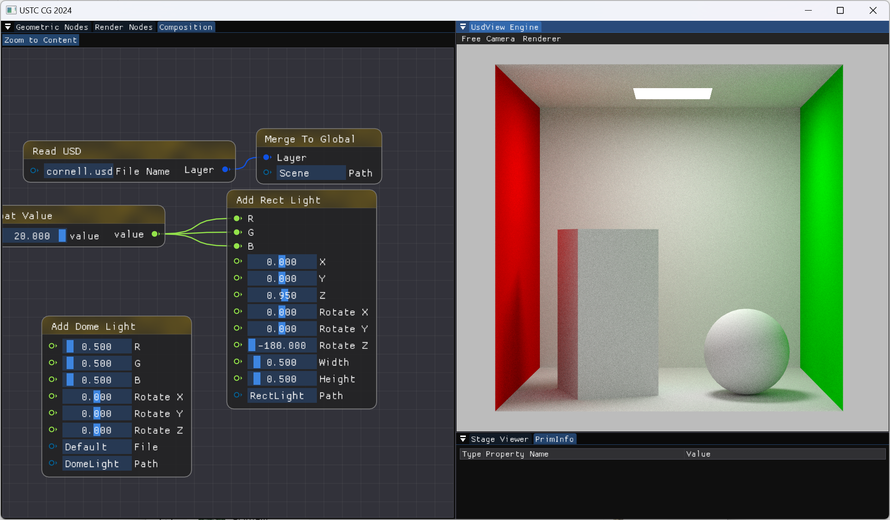
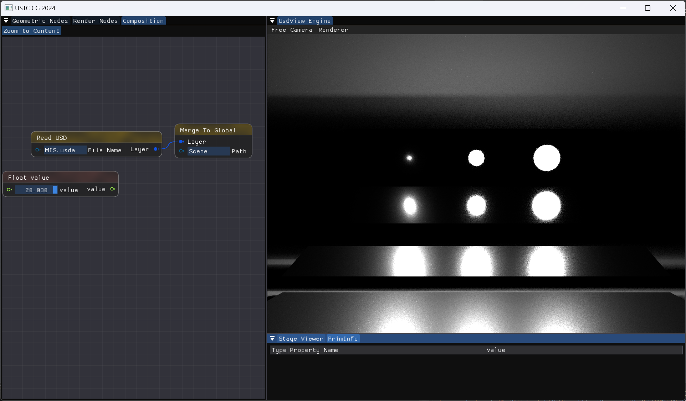
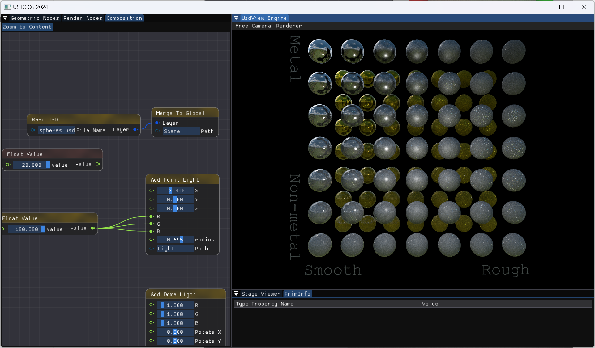
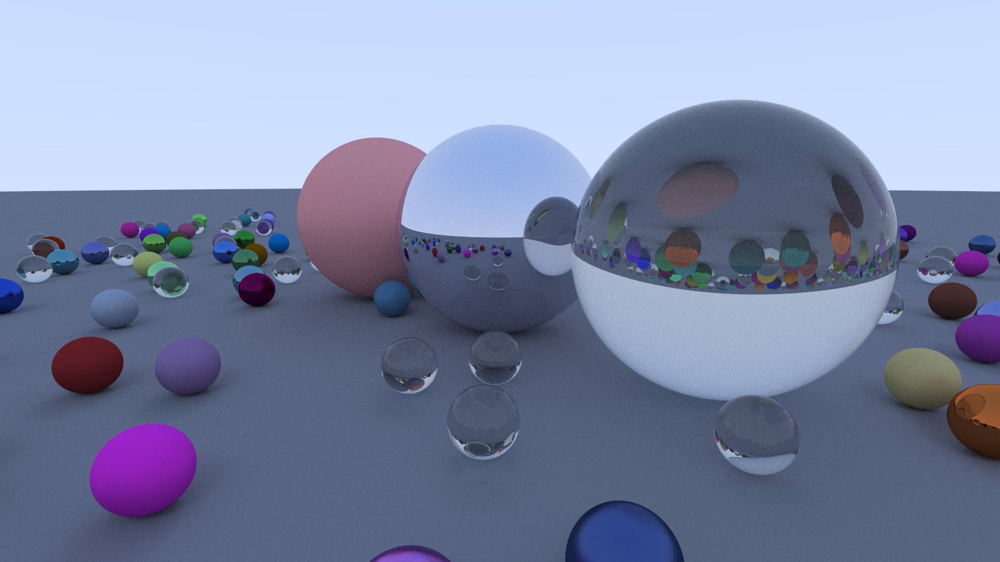
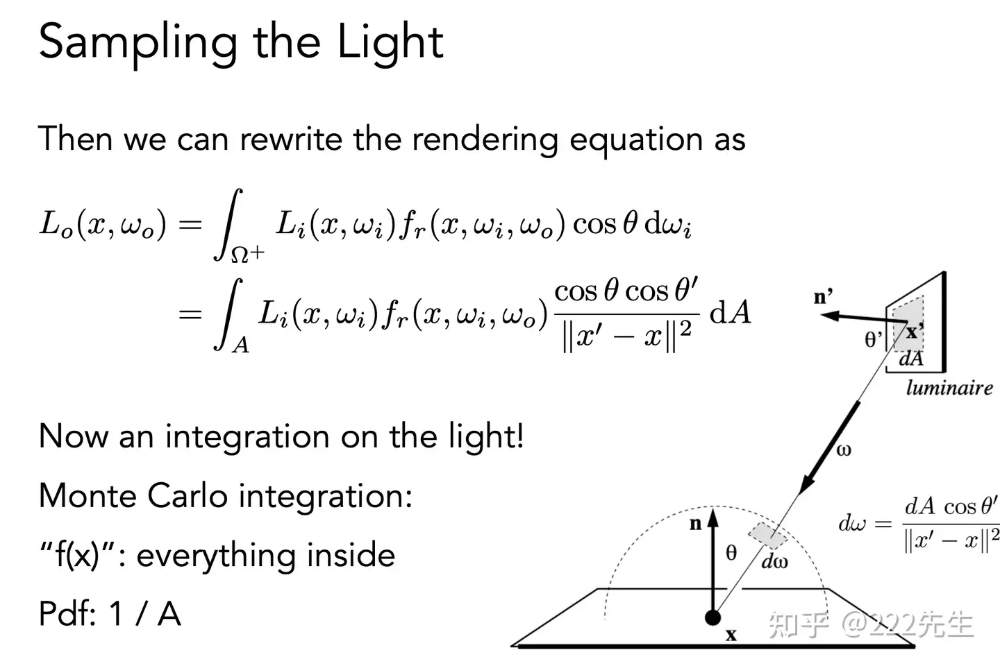
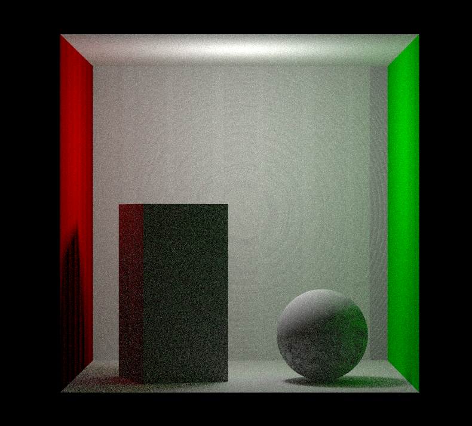
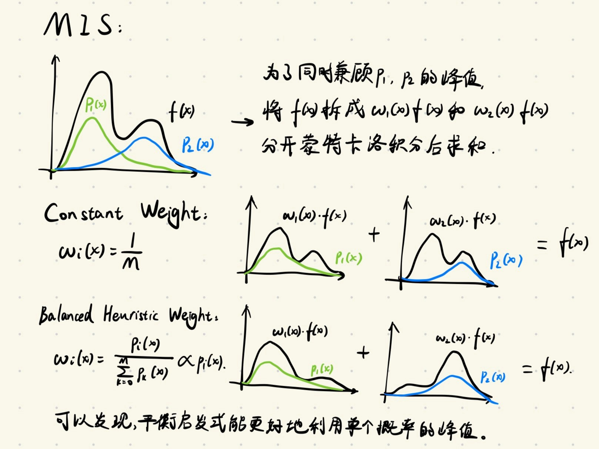

# Homework 7  作业报告 by 76-朱雨田

本次作业要求实现长方形光源的重要性采样，并将直接光照算法改写为路径追踪算法；在 microfacet 分支上实现 BRDF 采样与多重重要性采样（MIS）算法；实现多种材质渲染。

在这次作业中，我完成了上面的前两项；最后一项我由于时间限制并没有在本次作业框架中实现，但我在这周写了个 Ray Tracing in One Weekend，也许也能算是填上了金属材质和透明材质的坑？

我的路径追踪运算结果如下（spp=512）：



以下是 MIS 的展示效果（spp=256）：





这次作业中我尝试了实现 GGX Model 以进行材质渲染，但最终没有成功渲染出理想的效果。但是我还用零碎时间把 Ray Tracing in One Weekend 实现了一遍，效果如下（景深没有做，我觉得后处理不算这里的重点（？））：



## 1. 长方形光源采样

### 重要性采样

对于不发光的物体，其渲染方程如下：
$$
L_o = \int_{\Omega} L_i \rho  G d\omega ,
$$
其中 $L_i$ 表示接收到的辐射度， $\rho$ 表示 BRDF，$G$ 表示几何项（ $\cos$ 项）。

为了避免求和项数随着光线传播指数级增长，我们常用以下蒙特卡洛积分，将求积分问题转化为概率期望问题：
$$
\int_{ }^{ }f\left(x\right)dx=\int_{ }^{ }\frac{f\left(x\right)}{p\left(x\right)}d\left(P\left(x\right)\right)=\lim_{N \to \infty}\frac{1}{N}\sum_{i=0}^{N}\frac{f\left(x_{i}\right)}{p\left(x_{i}\right)}=E\left(\frac{f\left(x\right)}{p\left(x\right)}\right)
$$
由概率统计知识我们可以知道，当样本中 $\dfrac{f(x)}{p(x)}$ 的方差越小时，整个均值收敛于期望的速度就越快。重要性采样所做的就是尽可能降低该方差，从而加快收敛速度，避免无用计算。

由此，我们可以从多个角度估计被积函数的值，从而对被积函数做一定程度的拟合。

### 对光源采样

我们先尝试对渲染方程中被积函数的 $L_i$ 项做拟合。可以认为，光源方向的 $L_i$ 要显著大于其余方向，因此我们可以试着增大这一方向的 $p(x)$。

既然光源的位置对被求积分的点而言是已知的，那我们甚至可以随机选取一个光源，再将该光源覆盖不到的方向的 $p(x)$ 设为 $0$ ！如果该光源未被遮挡，那么这次采样将会很有价值——光源方向的 $L_i$ 值一定是很大的。如果光源被遮挡了，我们认为这次采样被浪费了，但综上而言，对光源采样是能很有效地降低噪声的。

操作上，我们先任意选择一个光源，再在光源上随机选取一点，对其进行采样，再根据位置反推其在选取该光源条件下的 PDF 值。该次采样中该光源被选中的概率为 $1$，因此最后计算期望所用的 PDF 就等于在光源上选到该点的概率。

这里一些条件概率的东西我在实际写的时候还是想了很久，调了一个晚上都没调明白（之前都白学了！）。躺在床上突然悟了，于是第二天几分钟就把长方形光源采样调出来了。因为报告写的比较仓促，所以也很难在报告里慢慢写清楚，也许参考意义并不大了。

### 长方形光源



我们可以用随机函数对长方形的顶点均匀插值，从而任意选取一个采样点。在这种采样模式下，立体角 $\omega$ 对应的 PDF 满足 $p(x')=\dfrac{||x'-x||^2}{A \cos \theta'}$ ，其中各个量的意义如上图。该 PDF 可以用 Jacobi 行列式计算得出。（我当时计算了好久...暴露了薄弱的多元微积分基础，后面才发现有现成的可以抄）

上图还展示了我们可以求出面积 $A$ 对应的 PDF $p=\dfrac{1}{A}$，并将渲染积分的立体角项换元为面积项。不难验证这两种方法实际上是等价的，但求出立体角对应的 PDF 更有利于对 PDF 进行统一地处理，如进行 MIS 采样等。

具体实现如下：

```cpp
float x = uniform_float(), y = uniform_float();
auto sampledPosOnSurface = corner0 + base_x * x + base_y * y;

sampled_light_pos = sampledPosOnSurface;
dir = (sampledPosOnSurface - pos).GetNormalized();
float dist = (sampledPosOnSurface - pos).GetLength();

float cosVal = GfDot(dir, -normal);
sample_light_pdf = 1 / width / height / cosVal * dist * dist;
```

输出部分，我这里希望使长方形光源只向下发光，因此用了以下代码进行限制：

```cpp
bool success = true;
if (GfDot(normal, corner0 - pos) > 0)
    normal = -normal;
else
    success = false;

//...

if (success)
    return irradiance / M_PI;
else
    return Color{ 0 };
```

## 2. 路径追踪

将除了光源外部分的被采样概率全部设为 0，显然是无法很好地实现全局光照的。因此，我们还需要在对光源采样后再做一次采样，来捕捉其他部分的射线。这次采样也可以引入一定的重要性，如框架中的 Sample 是以余弦值为权重的，这是为了拟合渲染方程的 $\cos$ 项。这次的重要性采样并不会导致一些区域采集不到，因此我们可以认为，加入了全局采样后的算法最终能收敛至正确的渲染积分。

路径追踪部分要求我们仿照 direct.cpp 实现 path.cpp。

path.cpp 里实际上已经对迭代次数做了限制。但是我们仍然试着实现以下俄罗斯轮盘赌：

```cpp
// Russian roulette
const float russian_roulette_probability = 0.8f;
if (uniform_float() > russian_roulette_probability)
    return directLight;
```

全局光照采样部分，我们只要仿照直接光照，计算积分中的每一项，去填充渲染积分即可。

```cpp
// Global Lighting
GfVec3f globalLight;
GfVec3f wi;
Color fr;
float pdf;

si.Sample(wi, pdf, uniform_float);
auto li = EstimateOutGoingRadiance( GfRay(si.position + 0.0001f * si.geometricNormal, wi), uniform_float, recursion_depth + 1);
fr = si.Eval(wi);
float cosVal = abs(GfDot(si.shadingNormal, wi));
globalLight = GfCompMult(li, fr) * cosVal / pdf;
```

`si` 中封装了生成采样光线，并在世界坐标和切线坐标下转换的函数，这让我们的代码实现更加简单了。

$L_i$ 项需要递归计算辐射值。生成射线时有必要将射线的起始位置向法向做微小偏移，否则会生成如下的 Shadow Ance：



图中不自然的“波动”是射线与物体的自相交导致的。

BRDF 项、几何项的计算仿照直接光照即可。

## 3. 重要性采样

对光源采样并不是所有时候都能很好地拟合被积函数的。对于金属材质，在同一 $\omega _o$ 下，其对 $\omega _i$ 的 BRDF 值较为“突出”于 $\omega _o$ 的反射光方向上，这意味着光源方向上取到的 $\omega _i$ 很有可能会是 BRDF 的低值，从而得到的拟合效果与实际的三项相乘仍然相差甚远。而对于漫反射材质，其 BRDF 在任何方向都很均匀，如果仅用 BRDF 去拟合 PDF，则很难拟合出光源制造的突出项，效果依然很差。

因此，我们希望结合多种 PDF 进行采样，这就导致了 MIS 的提出：

MIS 先用多种采样方式都进行一次采样，再根据采样得到的 PDF 按一定权重对最终采样结果进行组合。正确性推导如下：
$$
\sum_{i=0}^{M}w_{i}\left(x\right)\cdot E\left(\frac{f\left(x\right)}{p_{i}\left(x\right)}\right)=\sum_{i=0}^{M}E\left(\frac{\left(w_{i}\left(x\right)f\left(x\right)\right)}{p_{i}\left(x\right)}\right)
		\\=\sum_{i=0}^{M}\int_{ }^{ }w_{i}\left(x\right)f\left(x\right)dx=\int_{ }^{ }\left(\sum_{i=0}^{M}w_{i}\left(x\right)\right)_{ }f\left(x\right)dx=\int_{ }^{ }f\left(x\right)dx
$$
其中权重的选取有多种方式，如 Constant Weight 和 Balanced Heuristic Weight。后者的公式为：
$$
		w_{i}\left(x\right)=\frac{N_{i}\ p_{i}\left(x\right)}{\sum_{k=0}^{M}N_{k}\ p_{k}\left(x\right)}
$$
可以看到其更偏重于 PDF 更大的采样。

下图是我对 MIS 的一些几何理解，即把一个蒙特卡洛积分拆成多个，拆开后的每个被积函数都对其对应的 PDF 有优势。（这张是几个月前的图了...现在的理解也许会比那个时候更深刻一些，但我已经没有时间做更详细的作业报告了）



以下是根据 MIS 改写后的 `Integrator::EstimateDirectLight` 函数：

```cpp
// Sample the lights.
GfVec3f wi1;
float sample_light_pdf = 0;
GfVec3f sampled_light_pos1;
auto sample_light_luminance =
    SampleLights(si.position, wi1, sampled_light_pos1, sample_light_pdf, uniform_float);
auto brdfVal1 = si.Eval(wi1);
GfVec3f contribution_by_sample_lights{ 0 };
if (this->VisibilityTest(si.position + 0.0001f * si.geometricNormal, sampled_light_pos1)) 
{
    contribution_by_sample_lights = GfCompMult(sample_light_luminance, brdfVal1) * abs(GfDot(si.shadingNormal, wi1)) / sample_light_pdf;
}

// Sample the BRDF.
GfVec3f wi2;
float sample_brdf_pdf = 0;
GfVec3f sampled_light_pos2;
auto brdfVal2 = si.Sample(wi2, sample_brdf_pdf, uniform_float);
auto sample_light_brdf_luminance =
    IntersectLights(GfRay(si.position, wi2), sampled_light_pos2);
GfVec3f contribution_by_sample_brdf{ 0 };
if (this->VisibilityTest(si.position + 0.0001f * si.geometricNormal, sampled_light_pos2))
{
    contribution_by_sample_brdf = GfCompMult(sample_light_brdf_luminance, brdfVal2) * abs(GfDot(si.shadingNormal, wi2)) / sample_brdf_pdf;
}

// MIS
float w_lights = sample_light_pdf / (sample_light_pdf + sample_brdf_pdf),
w_brdf = sample_brdf_pdf / (sample_light_pdf + sample_brdf_pdf);
return w_lights * contribution_by_sample_lights + w_brdf * contribution_by_sample_brdf;
```

## 4. Ray Tracing in One Weekend

这周有不少零散时间都是端着电脑到处跑。因为 Homework7 比较耗电又比较吃性能，不想在外面写，所以用在外面的时间把 Ray Tracing in One Weekend 复刻了一遍。因为大部分内容是理解了的，所以实际耗时比一周末短不少（？）不少代码是直接对照着写的，不过我相信现在我已经能不看参考手打出这篇教程的大部分代码了。

参考的中文翻译如下：

[Ray Tracing in One Weekend V3.0中文翻译（上） - 知乎 (zhihu.com)](https://zhuanlan.zhihu.com/p/128582904)

我比起教程做的主要改动是显式地写出了渲染积分的形式。对材质采样的函数原型如下：

```cpp
virtual bool sample(const vec3& wo, const HitRecord& rec, vec3& wi, double& pdf, vec3& fr) const = 0;
```

感觉传入一个 $\omega _o$ 其实有点多余，因为这里已经在 `rec` 中包含出射光线方向了。路径追踪的部分代码如下：

```c++
vec3 ray_color(const ray& r, const Hittable& scene)
{
	const double p_russian_roulette = 0.8;
	HitRecord rec;
	vec3 dir = r.direction().normalized();

	if(scene.hit(r, 0.0001, infinity, rec))
	{
		// Russian roulette
		if(random_double() > p_russian_roulette)
			return vec3(0.0);

		double pdf;
		vec3 wi;
		vec3 wo = -dir;
		vec3 fr;

		rec.material->sample(wo, rec, wi, pdf, fr);
		vec3 li = ray_color(ray(rec.pos, wi), scene);
		double cosval = dot(wi, rec.normal);
		vec3 col = li * fr * cosval / pdf;	
		return col;
	}

	return lerp(vec3(1.0), vec3(0.4, 0.6, 1.0), 0.5 * (dir.y() + 1.0) * 0.8 + 0.2);
}
```

可以看到这里显式地计算了渲染积分的每一项，尽管这里 PDF 还没有发挥其重要的作用。

在做这一步改动的时候我注意到教程里对三种材质都是没有计算其 $\cos$ 项的。这可能是因为 $\cos$ 项已经在计算教程中的“衰减”项时被隐式地包含了。因此，我这里在显式计算了 $\cos$ 项的同时，也在材质采样的 BRDF 中显式地除掉了 $\cos$ 项。

这篇教程对金属材质的实现是在采样时直接将 $\omega _i$ 选取为 $\omega _o$ 对法线的反射，再将选取后的方向用 fuzz 值做一些小干扰。实现代码如下：

```cpp
virtual bool sample(const vec3& wo, const HitRecord& rec, vec3& wi, double& pdf, vec3& fr) const
{
    vec3 distort = random_sphere_uniform(pdf) * fuzz_;
    wi = (reflect(-wo, rec.normal) + distort).normalized();
    pdf = 1.0 / 4 / pi * 3;
    fr = pdf * albedo_ / dot(rec.normal, wi);
    return true;
}
```

而对于透明材质，这里的实现是根据折射率计算折射光线与发生反射的光线比例（用概率的形式体现）。因为这里用同一个值计算了折射率和菲涅尔散射，因此会有折射率变高时玻璃球变“糊”的问题。

```c++
virtual bool sample(const vec3& wo, const HitRecord& rec, vec3& wi, double& pdf, vec3& fr) const
{
    vec3 albedo = vec3(1.0, 1.0, 1.0);
    double etai_over_etat = rec.front_face ? (1.0 / ref_idx_) : ref_idx_;

    vec3 refracted = refract(-wo, rec.normal, etai_over_etat);

    double NdotV = std::min(dot(wo, rec.normal), 1.0);
    double sin_theta = sqrt(1.0 - NdotV * NdotV);

    if(etai_over_etat * sin_theta > 1.0)
    {
        // 全反射
        vec3 reflected = reflect(-wo, rec.normal);
        wi = reflected;
        fr = albedo / dot(rec.normal, wi);
        pdf = 1.0;
        return true;
    }
    else
    {
        double reflect_prob = schlick(NdotV, etai_over_etat);
        if(random_double() < reflect_prob)
        {
            // 反射
            vec3 reflected = reflect(-wo, rec.normal);
            wi = reflected;
            fr = albedo / dot(rec.normal, wi);
            pdf = 1.0;
            return true;
        }
        else
        {
            // 折射
            wi = refracted;
            fr = albedo / dot(rec.normal, wi);
            pdf = 1.0;
            return true;
        }
    }
    return false;
}
```

以上的实现并没有特别考虑物理正确性，只追求了效果的近似。这和 PBR 的理念并不太符合。所以我一开始是打算直接跟着毛星云老师的 PBR 白皮书手动实现一下 Disney 原则的 PBR 的。但当时试了一晚上也没有得到比较能看的效果，也没能用 Blender 做出一个比较好的测试模型。因为下周就要数分期中了（！），而我还有好多作业没有写完，因此在作业框架里实现材质的 Optional 项就被扔掉了。

[【基于物理的渲染（PBR）白皮书】（一） 开篇：PBR核心知识体系总结与概览 - 知乎 (zhihu.com)](https://zhuanlan.zhihu.com/p/53086060)
以后有时间的话我一定会去把上面这些所讲的 PBR 材质啃透。

## 心得体会

实现长方形光源采样，算 Jacobi 的时候真的深深感受到了多元微积分基础的薄弱。算了一晚上都没算对，而下周就要考数分期中了！有点慌。

因为之前硬啃过一些 ReSTIR 相关的论文，这次 IS 与 MIS 的理解对我来说倒并不困难。其实除去因为算错而折磨的时间，Homework7 花费的时间相当短（？）

之前还想过试着导入一些别的模型来跑路径追踪，可惜因为时间不够而不了了之了。以后有时间再试着搓一个完善的渲染器吧。