# Homework 9  作业报告 by 76-朱雨田

本次作业要求实现 WCSPH 的流体仿真方法。用提供的节点图做仿真的效果如下；更多的仿真 gif 图在 `./gif` 目录下。

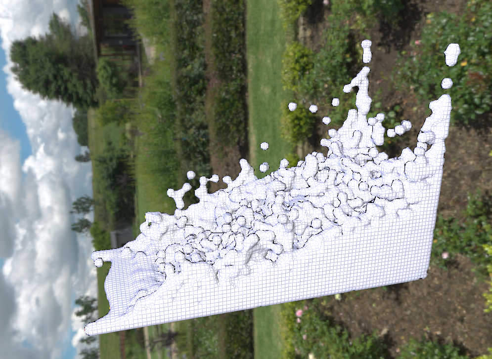

本次作业 WCSPH 部分的公式均为对每个粒子做简单的参数计算，无需用到 Eigen 求解方程组，论文中的算法流程也非常清晰，因此实现起来并不困难，编程的技巧不多。因此本次的报告也会比较简洁。

因为 OpenGL 渲染器始终报错而渲染不出图像，而路径追踪渲染器的材质有误（可能是因为我没有把 microfacet 合并进主分支？），所以报告中的所有图像都是用 Storm 渲染器进行渲染的。

因为时间紧张，我暂时还没有实现 IISPH。如果后面实现了，我会再更新一次报告。

## 实现细节

### WCSPH 子类的单步

框架的代码结构做了很好的模块化，我们严格按照论文所给流程组装模块进行实现即可。不过需要注意，计算完非粘性力后，应该只更新速度而不更新位移。若更新了位移，则会导致压强梯度力的计算存在误差，进而导致爆炸。

```cpp
ps_.assign_particles_to_cells();
ps_.search_neighbors();

compute_density();
compute_non_pressure_acceleration();
for (auto& p : ps().particles()) {
    p->vel() = p->vel() + dt() * p->acceleration();
}
compute_pressure_gradient_acceleration();
advect();
```

若将代码中三行更新速度的代码直接换为 `advect()`，模拟出的结果如下，可以看到产生了爆炸：

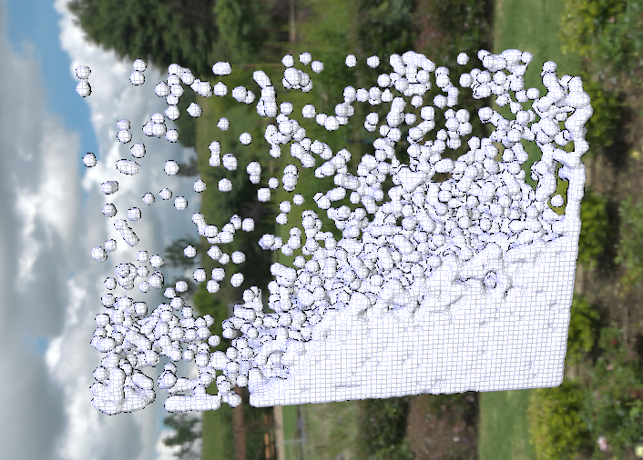

### 在 WCSPH 的密度计算中直接算出压强

根据公式，因为 WCSPH 子类中的压强大小只与物体密度有关，所以我们可以在计算密度的同时顺便算出粒子的压强。框架中 WCSPH 子类重载了 `compute_density()` 函数，因此我们在原有的公式后加两行计算和约束压强的代码即可。不过这并不会优化算法的复杂度。

```cpp
void WCSPH::compute_density()
{
	// -------------------------------------------------------------
	// (HW TODO) Implement the density computation
    // You can also compute pressure in this function 
	// -------------------------------------------------------------
        for (auto& p : ps().particles()) {
		double rho = ps().mass() * W_zero(ps().h());
        for (auto& q : p->neighbors()) {
            rho += ps().mass() * W(p->x() - q->x(), ps().h());
        }
        p->density() = rho;
        p->pressure() = stiffness() * (pow(p->density() / ps().density0(), exponent()) - 1);
        p->pressure() = std::max(0.0, p->pressure());
    }
}
```

### 边界处理

我的边界处理是直接在 `advect()` 中实现的。因为边界处理部分的代码直接更新了 `vel_` 和 `X_` 的值，因此应该在将这些值组装成矩阵前就做好边界处理。

```cpp
void WCSPH::compute_density()
{
	// -------------------------------------------------------------
	// (HW TODO) Implement the density computation
    // You can also compute pressure in this function 
	// -------------------------------------------------------------
        for (auto& p : ps().particles()) {
		double rho = ps().mass() * W_zero(ps().h());
        for (auto& q : p->neighbors()) {
            rho += ps().mass() * W(p->x() - q->x(), ps().h());
        }
        p->density() = rho;
        p->pressure() = stiffness() * (pow(p->density() / ps().density0(), exponent()) - 1);
        p->pressure() = std::max(0.0, p->pressure());
    }
}
```

### “Access violation...” 报错

我初步填完所有公式后，在 Release 下遇到了如下的报错：

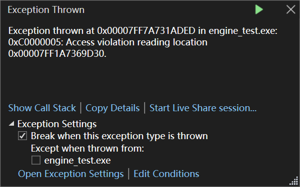

当粒子间间距过大（我当时认为原因是“粒子速度过大”）时便会触发这个问题。下图为报错的前一帧：

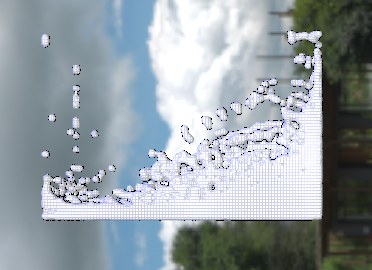

因为 Debug 模式下运行速度实在太慢（而且我也不太擅长调试），所以我用输出至控制台的方法，逐步缩小范围，定位了程序崩溃的位置。程序是在给粒子染色的步骤中崩溃的。

```cpp
MatrixXd SPHBase::get_vel_color_jet()
{
    MatrixXd vel_color = MatrixXd::Zero(vel_.rows(), 3);
    double max_vel_norm = vel_.rowwise().norm().maxCoeff();
    double min_vel_norm = vel_.rowwise().norm().minCoeff();

    auto c = colormap_jet;

    for (int i = 0; i < vel_.rows(); i++) {
        double vel_norm = vel_.row(i).norm();
        int idx = 0;
        if (fabs(max_vel_norm - min_vel_norm) > 1e-6) {
            idx = static_cast<int>(
                floor((vel_norm - min_vel_norm) / (max_vel_norm - min_vel_norm) * 255));
        }
        if (idx > 255 || idx < 0) {
            std::cout << "vel_norm = " << vel_norm << std::endl;
            std::cout << "idx = " << idx << std::endl;
        }
        vel_color.row(i) << c[idx][0], c[idx][1], c[idx][2];
    }
    return vel_color;
}
```

`idx` 期望的范围是 $[0, 255]$ 中的整数。但是在崩溃前，`idx` 的值是一个很大的随机数。进一步检查发现，此时 `vel_norm` 的值是 `nan`。

进一步回去定位速度开始变成 `nan` 的位置，发现在第一次更新速度时就已经出错了，也就是非压强梯度力就已经是 `nan` 了。检查公式：
$$
\nabla^2 \mathbf{v}_ i=2(d+2) \sum_j \frac{m_j}{\rho_j} \frac{\mathbf{v}_ {i j} \cdot \mathbf{x}_ {i j}}{\left\|\mathbf{x}_ {i j}\right\|^2+0.01 h^2} \nabla W_{i, j}
$$
公式中最值得怀疑的物理量是 $\rho _j$。输出后发现果然是 $0$。向前检查 `compute_density()` 函数，发现算出 $\rho=0$ 时邻居粒子的个数是 $0$。检查密度的计算公式，发现原来自己忘记考虑自身对密度的贡献了。当粒子间间距过大时，出现了核函数半径内没有其他粒子的孤立粒子，因此算出的密度为 $0$，导致了以上的一系列报错。修改这个问题后，程序就能正常模拟了。

~~值得一提的是，查这个错误花的时间比写 WCSPH 的其他时间还长不少，所以我才把它写进报告里~~

### OpenMP 优化

如果直接访问宏 `_OPENMP`，得到的结果是该宏不存在。我们需要在 nodes 目录下的 CMakeLists.txt 引入 OpenMP，只需要加两行代码即可：

```cmake
find_package(OpenMP REQUIRED)
target_link_libraries(nodes OpenMP::OpenMP_CXX)
```

重新 Configure，就能发现该宏存在了。

本框架中的 `compute_density()`, `compute_non_pressure_acceleration()`, `compute_pressure_gradient_acceleration()`, `advect()`，以及 `step()` 中对速度的更新均可以用 OpenMP 做到并行化。我们只需要把 `for` 循环从迭代器形式改为简单的单变量循环形式即可做到多线程，例如：

```cpp
#pragma omp parallel for
for (int i = 0; i < sz; i++) {
    auto& p = ps().particles()[i];
    p->vel() = p->vel() + dt() * p->acceleration();
}
```

测试多线程是否开启也很简单，只需在 for 循环内部输出 i，如果观察到 i 以随机的顺序输出了，那么就是已经在并行计算了。

在给自己实现的函数加上 OpenMP 后，效率仍然没有得到有效提升。输出时间戳结果，发现时间瓶颈在邻居搜索上：

```
Time taken by cell: 729 microseconds
Time taken by neighbor: 57767 microseconds
Time taken by density: 3351 microseconds
Time taken by non_pressure: 1932 microseconds
Time taken by updv: 44 microseconds
Time taken by pga: 1065 microseconds
Time taken by advect: 85 microseconds
Time taken by step: 66994 microseconds
```

因此给邻居搜索也加上多线程优化，现在虽然观感上仍然做不到实时（但步长其实够了？），但效率有可观的提升了。

```
Time taken by cell: 674 microseconds
Time taken by neighbor: 4979 microseconds
Time taken by density: 3191 microseconds
Time taken by non_pressure: 1851 microseconds
Time taken by updv: 28 microseconds
Time taken by pga: 1074 microseconds
Time taken by advect: 43 microseconds
Time taken by step: 13537 microseconds
```

## 参数对比分析

框架的节点图提供了四个可调的物理参数：viscosity, gravity, stiffness, exponent。

### 调整 Viscosity

$$
\rho \frac{D \mathbf{v}}{D t} =\rho g+\mu \nabla^2 \mathbf{v}
$$

观察公式可以发现，$\mu$ 越大，阻碍物体运动的力就越大。调整参数可以发现，Viscosity 越大，流体表面“趋于平静”的速度就越快。特别地，下图展示了 Viscosity=0 时，t=200 时的流体仿真情形。可以看到流体表面始终有粒子在不停运动。

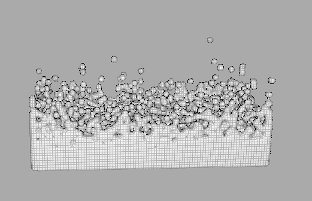

其他仿真图像见 gif 下的目录：

| 文件            | 描述                          |
| --------------- | ----------------------------- |
| ./gif/v0.03.gif | 提供的原始参数                |
| ./gif/v0.gif    | viscosity=0，其余参数未变动   |
| ./gif/v0.3.gif  | viscosity=0.3，其余参数未变动 |
| ./gif/v0.8.gif  | viscosity=0.8，其余参数未变动 |

特别地，将 Viscosity 调为一个非常大的的值，会引起粒子系统的爆炸。如下图所示（这里的 Viscosity 为 3）：

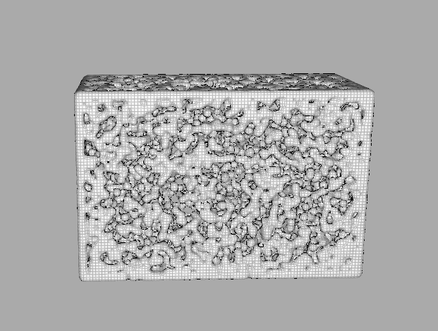

当 Viscosity调整为 1.1 时，虽然不会发生爆炸，但能观察到一些粒子的速度异常地快。

### 调整 Gravity

重力为 $0$ 的情形比较有趣。粒子只受到压强梯度力和粘性力的作用，将会受压强作用而快速”爆炸式“地填满整个空间。为了提高爆炸的速度，这里用了 Viscosity=0.3, Stiffness=5000 的参数进行了模拟。（Viscosity=0.03 下粒子会到处乱飞，不太好看）

GIF 图保存在了 `./gif/grv0.gif` 中。

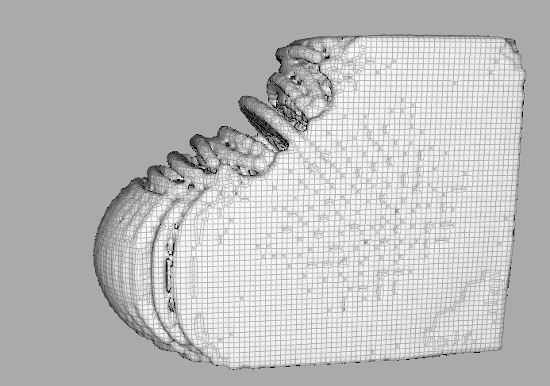

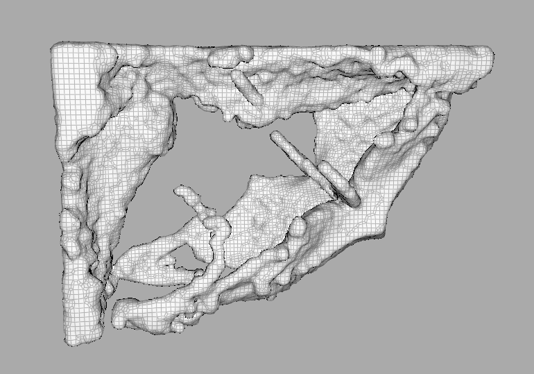

### 调整 Stiffness

WCSPH 的公式中，Stiffness 是对压强梯度力整体放缩的物理量。因为 WCSPH 是弱可压缩的 SPH 方法，其不可压缩性实际上是通过将 Stiffness调为一个较大的值做到的。

当 Stiffness 变得更大时，流体在下落过程中就会先膨胀为球体，如下图（Viscosity = 0.8, Stiffness = 10000）：

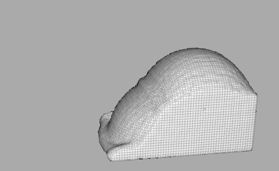

以上数据生成的 GIF 图保存在了 `./gif/s10000.gif` 中。

再进一步增大取值（到 50000 的数量级），流体也会发生爆炸。

下表比较了 Stiffness 在不同取值时流体表面平静后的厚度，体现了该参数对压强梯度力的控制（Viscosity = 0.8）：

| 0                                          | 50                                         | 500                                        | 10000                                      |
| ------------------------------------------ | ------------------------------------------ | ------------------------------------------ | ------------------------------------------ |
| 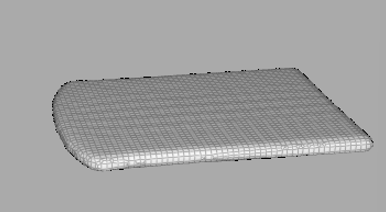 | 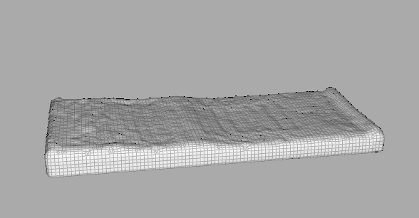 | 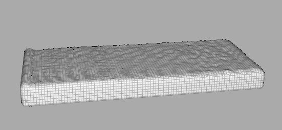 | 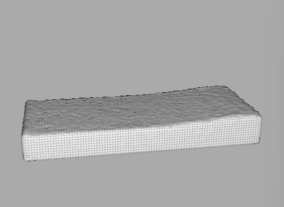 |

可以看到表面平静后的厚度随着 Stiffness 的增加而增大，越来越接近“不可压缩”的特性。特别地，Stiffness 取值为0时，流体会退化成无相互压力作用，仅在最底层缓慢移动的薄膜。

### 调整 Exponent

$$
p_i =k_1 \left( \left(\frac{\rho_i}{\rho_0} \right)^{k_2} -1 \right)
$$

观察公式可以发现，Exponent 是调整密度差异对压强梯度力贡献的物理量，其增大后也会使得压强梯度力整体放大，与 Stiffness 类似。

下表比较了 Exponent在不同取值时流体表面平静后的厚度（Viscosity = 0.8）：

| 0                                          | 3                                          | 7                                          | 15                                         |
| ------------------------------------------ | ------------------------------------------ | ------------------------------------------ | ------------------------------------------ |
| 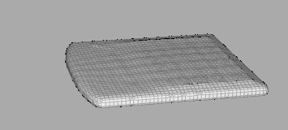 | 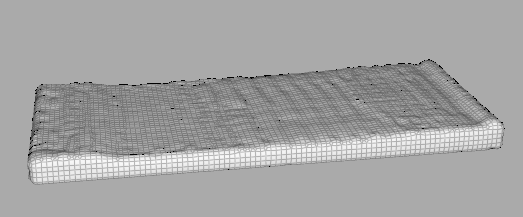 |  | 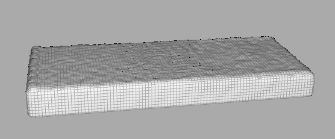 |

观察到的现象与调整 Stiffness 时是类似的，并且取值较大时也会发生同样”变成球体“与”爆炸“的现象。